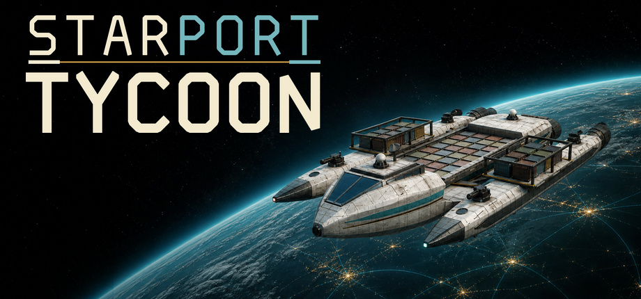

<div align="center">



# Starport Tycoon - Public Issue Tracker

**Build your company. Connect the stars. Keep the galaxy moving.**

[](https://github.com/Maikell84/Starport-Tycoon/issues/new?template=bug_report.yml)
[](https://github.com/Maikell84/Starport-Tycoon/issues/new?template=feature_request.yml)
[](https://github.com/Maikell84/Starport-Tycoon/issues)
[](https://store.steampowered.com/app/5012250/Starport_Tycoon)

Deutsch - [English](#english)

</div>

## Willkommen

Dies ist der **öffentliche Issue Tracker für Starport Tycoon**. Hier kannst du
Fehler melden, Verbesserungsvorschläge einreichen und bestehende Meldungen
ergänzen.

> [!NOTE]
> Dieses Repository enthält **nicht den Quellcode des Spiels**. Der Quellcode
> wird privat entwickelt; dieses Repository dient ausschließlich dem Austausch
> mit der Community.

## Bevor du eine Meldung erstellst

1. Prüfe die [offenen und geschlossenen Issues](https://github.com/Maikell84/Starport-Tycoon/issues),
   damit keine doppelte Meldung entsteht.
2. Starte das Spiel und - wenn möglich - den Computer einmal neu.
3. Prüfe, ob das Problem mit der neuesten verfügbaren Spielversion weiterhin
   auftritt.
4. Notiere die im Hauptmenü oder unter **über Starport Tycoon** angezeigte
   Versions- und Build-Nummer.

## Was gehört in einen guten Bug Report?

- eine kurze, eindeutige Beschreibung des Problems;
- genaue Schritte, mit denen sich der Fehler reproduzieren lässt;
- erwartetes und tatsächliches Verhalten;
- Spielversion/Build, Betriebssystem und Sprache;
- Häufigkeit des Fehlers;
- falls hilfreich: Screenshot, kurzes Video, Logdatei oder Spielstand.

Bitte ziehe Anhänge direkt in das Textfeld des Issue-Formulars. Entferne vorher
persönliche oder vertrauliche Daten. Öffentlich hochgeladene Dateien können von
allen Besuchern eingesehen werden.

## Meldung erstellen

- **[Fehler melden](https://github.com/Maikell84/Starport-Tycoon/issues/new?template=bug_report.yml)** - Abstürze, Darstellungsfehler, falsches Spielverhalten, Performanceprobleme oder Probleme mit Spielständen.
- **[Idee vorschlagen](https://github.com/Maikell84/Starport-Tycoon/issues/new?template=feature_request.yml)** - neue Funktionen, Komfortverbesserungen oder Balancing-Ideen.
- **[Sicherheitsproblem vertraulich melden](https://github.com/Maikell84/Starport-Tycoon/security/advisories/new)** - bitte keine Sicherheitslücken öffentlich als Issue einstellen.

Allgemeine Fragen können ebenfalls als Issue gestellt werden, wenn sie sich auf
ein konkretes Problem mit dem Spiel beziehen. Für Diskussionen ohne konkreten
Fehler ist der Issue Tracker nicht gedacht. Weitere Hinweise findest du unter
[Support](SUPPORT.md).

## Spielstände unter Windows

Starport Tycoon speichert Spielstände standardmäßig hier:

```text
C:\Users\<Name>\AppData\Roaming\Starport Tycoon\saves
```

Der tatsächlich verwendete Ordner wird im Ladebildschirm und in den Optionen
angezeigt. Bewahre vor änderungen oder dem Hochladen immer eine Sicherungskopie
deines Spielstands auf.

## Verhalten in der Community

Bitte bleibe freundlich, sachlich und geduldig. Unterschiedliche Erfahrungen
und Meinungen sind willkommen; Beleidigungen, Belästigung und diskriminierende
Inhalte nicht. Siehe [CONTRIBUTING.md](CONTRIBUTING.md).

---

<a id="english"></a>

## English

Welcome to the **public issue tracker for Starport Tycoon**. Use it to report
bugs, suggest improvements, and add useful information to existing reports.
The game's source code is private and is not hosted in this repository.

Before opening an issue, please search the
[existing reports](https://github.com/Maikell84/Starport-Tycoon/issues), confirm
the problem still occurs in the latest available version, and note the version
and build number shown in the game.

A useful report includes:

- clear steps to reproduce the problem;
- expected and actual behaviour;
- game version/build, operating system, and language;
- how often the problem occurs;
- screenshots, a short video, logs, or a save file when relevant.

Do not upload passwords, account details, personal data, or other confidential
information. Attachments in public issues are visible to everyone.

- **[Report a bug](https://github.com/Maikell84/Starport-Tycoon/issues/new?template=bug_report.yml)**
- **[Suggest an idea](https://github.com/Maikell84/Starport-Tycoon/issues/new?template=feature_request.yml)**
- **[Report a security issue privately](https://github.com/Maikell84/Starport-Tycoon/security/advisories/new)**

For more guidance, see [SUPPORT.md](SUPPORT.md).

Thank you for helping make Starport Tycoon better. 🚀

---

<sub>Starport Tycoon and its artwork are proprietary. No license to the game,
its source code, or its assets is granted by this issue-tracker repository.</sub>
